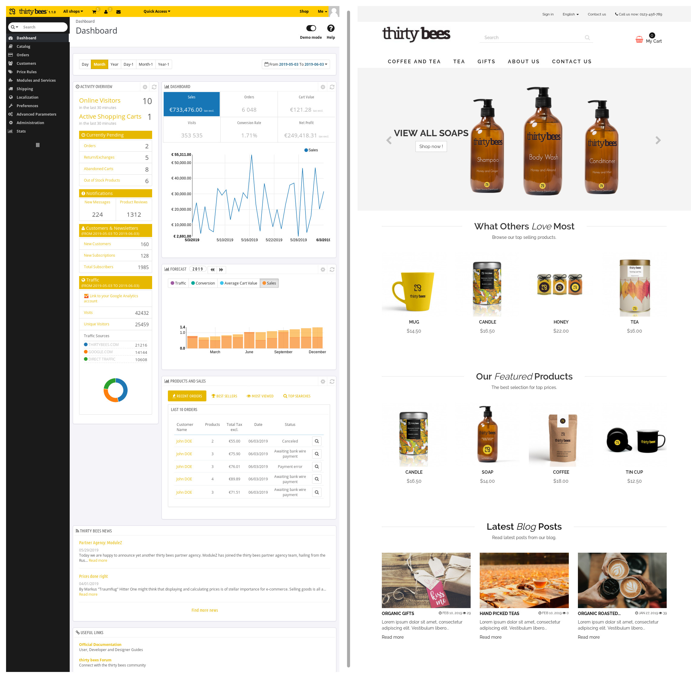

# thirty bees
[](https://travis-ci.org/thirtybees/thirtybees)
[](https://crowdin.com/project/thirty-bees)
[](https://forum.thirtybees.com/discover/)

thirty bees is a matured e-commerce solution which once started as a fork of PrestaShop 1.6.1.11 and is still compatible with (almost) all PS 1.6 modules. Its focus is on stability, correctness and reliability of the rich feature set, to allow merchants to focus on growing their business.

## Supporters

thirty bees is commited to being free and open source. We are also committed to making all software that thirty bees develops free and open source. For that reason we have setup a [Patreon](https://www.patreon.com/thirtybees) page so our community can help support us. You can [view our current list of supporters here](https://github.com/thirtybees/thirtybees/blob/1.0.x/SUPPORTERS.md) which will be shipped with all thirty bees versions moving forward.



## Roadmap

- Remove really old code. Like retrocompatibility code for PS 1.4 and older.
- Allow Core Updater to update to latest changes in the Github repository. Then one will be able to update a shop minutes after a bug got fixed.
- Extend Core Updater to also upgrade the database. This will bring additional reliability to the shop database as well.
- Remove pointless configuration switches in back office. Quite a number of them are outdated or useless, just distracting merchants and slowing down operations.
  - Support for multiple encryption algorithms. One reliable encryption is entirely sufficient.
  - Support for mixed HTTP/HTTPS sites. This was a good idea in 2005, but triggers browser warnings today.
  - ...
- Package management for JavaScript and CSS vendor packages as well.
- Bring all modules provided by thirty bees to the standards level of default modules.
- Bootstrap 4 for back office.
- Goal for thirty bees 1.2.0: **Zero Known Bugs**.

## Requirements
Support for these general requirements (except recommendations) gets tested during installation, so one can simply try to proceed. A proceeding installation means all requirements are met.

- PHP 5.6 - PHP 7.3 with a minimum of 128 MiB RAM
- Apache or nginx
- Linux or MacOS
- MySQL 5.5.3+ or MariaDB 5.5+
- PHP extensions:
  - Required:
    - bcmath
    - gd
    - json
    - mbstring
    - openssl
    - mysql (PDO only)
    - xml (SimpleXML, DOMDocument)
    - zip
  - Recommended:
    - imap (for allowing to use an IMAP server rather than PHP's built-in mail function)
    - curl (for better handling of background HTTPS requests)
    - opcache (not mandatory because some hosters turn this off in favor of other caching mechanisms)
    - apcu/redis/memcache(d) (for the (currently incomplete) full page cache)

## Browser support

| [](http://godban.github.io/browsers-support-badges/)</br>IE / Edge | [](http://godban.github.io/browsers-support-badges/)</br>Firefox | [](http://godban.github.io/browsers-support-badges/)</br>Chrome | [](http://godban.github.io/browsers-support-badges/)</br>Safari | [](http://godban.github.io/browsers-support-badges/)</br>Opera | [](http://godban.github.io/browsers-support-badges/)</br>iOS Safari | [](http://godban.github.io/browsers-support-badges/)</br>Chrome for Android |
| --------- | --------- | --------- | --------- | --------- | --------- | --------- |
| IE9, IE10, IE11, Edge| 30+ | 30+ | 9+ | 36+ | 9+ | 30+ |

Browserlist string: <code>[defaults, ie >= 9, ie_mob >= 10, edge >= 12, chrome >= 30, chromeandroid >= 30, android >= 4.4, ff >= 30, safari >= 9, ios >= 9, opera >= 36](http://browserl.ist/?q=defaults%2C+ie+%3E%3D+9%2C+ie_mob+%3E%3D+10%2C+edge+%3E%3D+12%2C+chrome+%3E%3D+30%2C+chromeandroid+%3E%3D+30%2C+android+%3E%3D+4.4%2C+ff+%3E%3D+30%2C+safari+%3E%3D+9%2C+ios+%3E%3D+9%2C+opera+%3E%3D+36)</code>

## Installation for Shop Owners

- Download the [latest release package](https://github.com/thirtybees/thirtybees/releases) (_thirtybees-vXXX.zip_, ~43 MiB).
- Unpack this ZIP file into your web hosting directory. If you have no shell access, unpack it locally and upload all files, e.g. with [FileZilla](https://filezilla-project.org/). Using a subdirectory works fine.
- Direct your browser to your webhosting, it should show the installer.
- Follow instructions.

## Installation for Developers

You can install the master or follow a [release package](https://github.com/thirtybees/thirtybees/releases)
- Recursively clone the repository and choose tag release version number from the -b parameter:
```shell
$ git clone https://github.com/thirtybees/thirtybees.git --recursive -b #.##
```
- Then cd into the `thirtybees` folder
- Run composer to install the dependencies:
```shell
$ composer install
```
- Then install the software as usual, using either a web browser (https://example.com/install-dev)
- Or install via command line
```shell
$  php install-dev/index_cli.php --newsletter=1 --language=en --country=us --domain=thirty.bees:8888 --db_name=thirtybees --db_create=1 --name=thirtybees --email=test@thirty.bees --firstname=thirty --lastname=bees --password=thirtybees
```
- Arguments available:
```
--step          all / database,fixtures,theme,modules                   (Default: all)
--language      Language iso code                                       (Default: en)
--all_languages Install all available languages                         (Default: 0)
--timezone                                                              (Default: Europe/Paris)
--base_uri                                                              (Default: /)
--domain                                                                (Default: localhost)
--db_server                                                             (Default: localhost)
--db_user                                                               (Default: root)
--db_password                                                           (Default: )
--db_name                                                               (Default: thirtybees)
--db_clear      Drop existing tables                                    (Default: 1)
--db_create     Create the database if not exist                        (Default: 0)
--prefix                                                                (Default: tb_)
--engine        InnoDB                                                  (Default: InnoDB)
--name                                                                  (Default: thirty bees)
--activity                                                              (Default: 0)
--country                                                               (Default: fr)
--firstname                                                             (Default: John)
--lastname                                                              (Default: Doe)
--password                                                              (Default: 0123456789)
--email                                                                 (Default: pub@thirtybees.com)
--license       Show thirty bees license                                (Default: 0)
--newsletter    Get news from thirty bees                               (Default: 1)
--send_email    Send an email to the administrator after installation   (Default: 1)
```

## Contributing
See [CONTRIBUTING.md](CONTRIBUTING.md)
